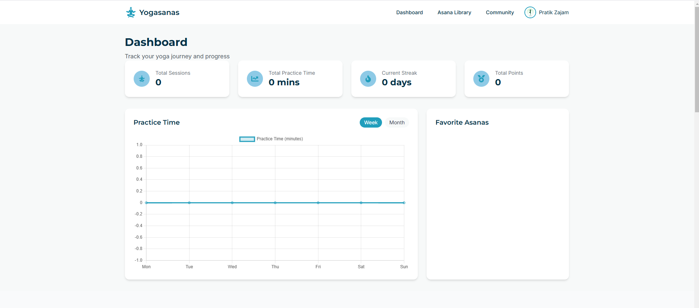

# **Yogasanas Tracker**  

**Yogasanas Tracker** is a web application designed to help users monitor and enhance their yoga practice. It offers a platform to track progress, set goals, and connect with a community of fellow practitioners.  

## **Features**  

- **Personalized Dashboard**: View your yoga journey, track daily practices, and monitor improvements.  
- **Goal Setting**: Define personal yoga goals and receive reminders to stay motivated.  
- **Community Engagement**: Connect with other users, share experiences, and participate in group challenges.  
- **Asana Library**: Access a comprehensive library of yoga poses with detailed descriptions and benefits.  

## **Live Demo**  

Check out the live version of the application here: [Yogasanas Tracker](https://the-code-warriers.vercel.app/)  

## **Screenshots & Descriptions**  

### 1. **Homepage - Welcome Screen**  
The welcome page introduces the platform and its purpose. Users can track their progress, join challenges, and connect with the yoga community.  

  

**Extracted Text:**  
_"Transform Your Yoga Practice, Together. Track your progress, join challenges, and connect with a community of yoga enthusiasts."_  

---  

### 2. **Login Page**  
The login page allows users to sign in to their accounts or create a new one. It provides options for password recovery and remembering login details.  

  

**Extracted Text:**  
_"Sign in to your account or create a new one. Email address | Password. Remember me | Forgot your password?"_  

---  

### 3. **Dashboard**  
The dashboard provides an overview of the user's yoga journey, including total practice time, current streak, and favorite asanas.  

  

**Extracted Text:**  
_"Track your yoga journey and progress. Total Sessions | Total Practice Time | Current Streak | Total Points."_  

---  

### 4. **Pricing Plans**  
The pricing section offers different subscription plans, from a free basic tier to a premium Pro plan with one-on-one coaching and exclusive content.  

  

**Extracted Text:**  
_"Choose Your Perfect Plan. Start your yoga journey with flexible pricing options. Plans include Free, Basic, Premium, and Pro."_  

---  

### 5. **Asana Library**  
The Asana Library allows users to explore different yoga poses, search for specific asanas, and learn about their benefits.  

  

**Extracted Text:**  
_"Explore and learn about different yoga poses. Search asanas by name or Sanskrit. Examples include Downward-Facing Dog, Warrior I, Tree Pose."_  

---  

### 6. **Community Page**  
The community section enables users to connect with fellow yoga practitioners, share experiences, and join challenges.  

  

**Extracted Text:**  
_"Connect with fellow yoga enthusiasts and join challenges. Share your yoga journey and engage in discussions."_  

---  

## **Installation**  

To run this project locally:  

1. **Clone the repository**:  
   ```bash
   git clone https://github.com/your-username/yogasanas-tracker.git
   ```  
2. **Navigate to the project directory**:  
   ```bash
   cd yogasanas-tracker
   ```  
3. **Install dependencies**:  
   ```bash
   npm install
   ```  
4. **Start the development server**:  
   ```bash
   npm run dev
   ```  
   The application will be accessible at `http://localhost:5173`.  

## **Deployment**  

This project is deployed using [Vercel](https://vercel.com/), providing seamless integration and continuous deployment.  

## **Contributing**  

We welcome contributions to enhance the Yogasanas Tracker. To contribute:  

1. Fork the repository.  
2. Create a new branch:  
   ```bash
   git checkout -b feature-name
   ```  
3. Make your changes and commit them:  
   ```bash
   git commit -m 'Add new feature'
   ```  
4. Push to the branch:  
   ```bash
   git push origin feature-name
   ```  
5. Submit a pull request detailing your changes.  

## **License**  

This project is licensed under the MIT License. See the [LICENSE](LICENSE) file for details.  

## **Acknowledgements**  

Special thanks to the yoga community for their continuous support and feedback.  

---  

### **Note:**  
Make sure to replace `"path/to/image.png"` with the actual paths of the images in your repository.  

Let me know if you need any modifications! 🚀

